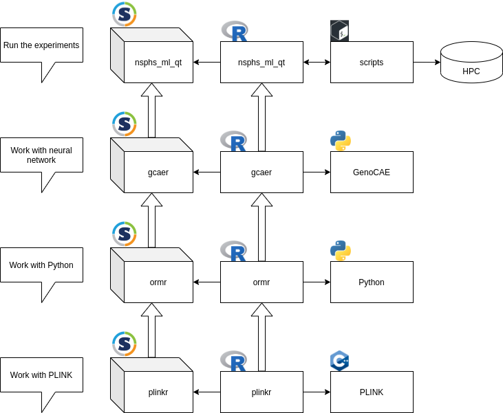

# singularity_blog_post

## Abstract

I am a reseacher that tries to predict
how people look like from their genetic code,
using a new artificial intelligence approach.
Thanks to Singularity and Sylabs I can do reproducible research
with privacy-sensitive data.

## My research

> Figure 1: my Sylabs dashboard

The goal of my research is to use a new machine learning
technique [1] to predict how how humans looks like based on
their genetic information. 
For this, I use the data from a 
population study [2]. 
In this study, 1069 individuals
participated, of who (among others) the concentration of 460 proteins
in the blood was measured. 
This type of data is called Genome-Wide Association Study (GWAS) data,
as it contains genetic information, as well as traits possibly associated
with it.
GWAS data is sensitive information and its publication 
could infringe their privacy. To safeguard these people's privacy,
this sensitive data is stored on a computer cluster that has no
internet access, except for a folder where data can be uploaded and downloaded.

## Why Singularity?

I use Singularity to be able to use any program I want/need
on the computer clusters I have access to. Computer clusters commonly
give restricted access to all its users: it is a resource shared 
between its users, hence it does not allow a user to do modify the shared
computing environment: only administrators can install, uninstall, upgrade
or downgrade programs. To be able to use your favorite program, when it
is not available under your High Performance Computing (HPC) environment,
Singularity is my favorite option.

## My workflow

My workflow consists out of 4 Singularity containers,
as shown in Figure 2.

> Figure 2: overview of my containers and packages

## The `plinkr` Singularity container

At the bottom is the `plinkr` Singularity container,
which allows me to work with the R programming language,
as well as working with GWAS data.

R is a commonly used free and open source (FOSS) programming language,
that is especially strong in statistics and allows one to share
code using packages.
I need R to be able to install R packages, do my analysis and
create plots of the results.

To work with GWAS data, I use a tool that is commonly used in my field, 
called PLINK [3,4]
(I use the later version, PLINK2, synonymously with PLINK). 
To work with PLINK, I use the not-yet-standard (hence not installed
on an HPC environment) R package called `plinkr`.
One of the things `plinkr` can do is download and install PLINK to a
standard location.
I set up my `plinkr` Singularity container to contain (1) an R environment,
(2) the `plinkr` R package and (3) PLINK pre-installed to a certain location.
In this way, one can work with GWAS data in any HPC environment.

## The `ormr` Singularity container

The container above, the `ormr` Singularity container,
allows me to work with the Python programming language
and an R package to work with Python.

Python is another commonly used free and open source (FOSS) programming language,
that runs code faster than R and also allows one to share
code using packages.

The `ormr` R package is a package that is not yet standard, which allows
one to work with Python: un/install packages and run Python code.
As this container depends on the `plinkr` container, R is already installed,
so all it does additionally is to install `ormr` and install some
Python packages.

I set up my `ormr` Singularity container to contain (1) a Python environment,
(2) the `ormr` R package and (3) some minimal Python packages
pre-installed to a certain location.
In this way, one can work with Python in any HPC environment.

## The `gcaer` Singularity container

The container above, the `gcaer` Singularity container,
allows me to work with the machine learning tool I use
and additionally installs and R package to work with that tool.

GenoCAE [1] is the Python package for a Genomic data Convolutional
Auto Encoder, which is a machine learning technique to let a
neural network learn understand the GWAS data to work on. 
It is in a way similar to a librarian learns to categorize books
into genres, but now on GWAS data. For GWAS data, this means that
the genomes of more similar individuals will be put close together.
As this container depends on the `ormr` container,
Python has already been set up.

The `gcaer` R package is a package that is not yet standard, which allows
one to work with GenoCAE: un/install it to a standard locaation
and run it. `gcaer` does much more than GenoCAE, as it is more rigorous
in testing if the input data is correct and gives more helpful error
messages. I enjoy it when code fails fast, instead of at the end of
a (long) calculation. Also, `gcaer` can read the output of GenoCAE and
put it into plots. As this container depends on the `plinkr` container,
R has already been set up.

I set up my `gcaer` Singularity container to contain (1) GenoCAE installed,
(2) the `gcaer` R package installed.
In this way, one can work with GenoCAE and `gcaer` in any HPC environment.

## The `nsphs_ml_qt` Singularity container

The Singularity container at the top, `nsphs_ml_qt` allows
me to do my experiments on the use for the Northern Swedish Population Health
Study of using a Machine Learning technique for Quantitative Traits (i.e. traits that have 
a number, such as a protein concentration, as opposed to having a disease yes/no).

This container only contains the `nsphs_ml_qt` R package.
This package allows to run and analyse my experiments at a higher level.
As this container depends on the `plinkr` container,
R has already been set up, so it only installs the `nsphs_ml_qt` R package.

## Why that workflow?

I use this workflow to make me feel confident that the results
of my experiments are correct and reproducible.

I have chosen to split up my workflow into 4 smaller units, 
instead of 1 big one, so that each unit has one single and clear purpose.
Each of these smaller units installs an R package that is tested
using the Continuous Integration (CI) service called GitHub Actions,
which is free to use for FOSS software. Due to the amount of passing tests,
I feel more confident my code actually does what I intend it to do.

Finally, using Singularity, another researcher can use my container
and scripts to re-do my experiments. This is important to me, as
reproducibility is a pillar of good science.

## Lessons learned

I learned that the most important thing when building a Singularity
container, is to depend on another, well-tested, container.
In my case, I discover The Rocker Project [5], that produces Docker
containers for R. My `plinkr` container depends on one of their containers.

Another thing I learned, is that the Singularity developer I ran into
most often, Vanessa [6], is a joy to work with. She is fast and
appreciates my -hopefully well-written- bug reports to make
Singularity even better.

## Conclusion

Singularity is a great way to do good science, by allowing
anyone to run well-tested containers in their favorite environment.
I do suggest to prefer to select a well-crafted container to extend,
over writing one from scratch.

## References

 * [1] Kristiina Ausmees, Carl Nettelblad, A deep learning framework for characterization of genotype data, G3 Genes|Genomes|Genetics, 2022;, jkac020, [https://doi.org/10.1093/g3journal/jkac020](https://doi.org/10.1093/g3journal/jkac020)
 * [2] Igl, Wilmar, Åsa Johansson, and Ulf Gyllensten. "The Northern Swedish Population Health Study (NSPHS)–a paradigmatic study in a rural population combining community health and basic research." Rural and remote health 10.2 (2010): 198-215.
 * [3] Purcell S, Neale B, Todd-Brown K, Thomas L, Ferreira MAR, Bender D, Maller J, Sklar P, de Bakker PIW, Daly MJ & Sham PC (2007) PLINK: a toolset for whole-genome association and population-based linkage analysis. American Journal of Human Genetics, 81.
 * [4] Chang CC, Chow CC, Tellier LCAM, Vattikuti S, Purcell SM, Lee JJ (2015) Second-generation PLINK: rising to the challenge of larger and richer datasets. GigaScience, 4.
 * [5] [https://www.rocker-project.org/](https://www.rocker-project.org/)
 * [6] [@vsoch](https://github.com/vsoch)
